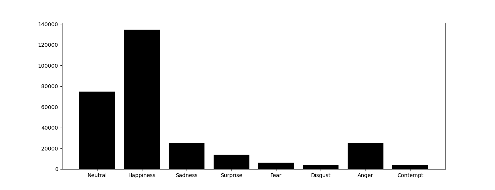
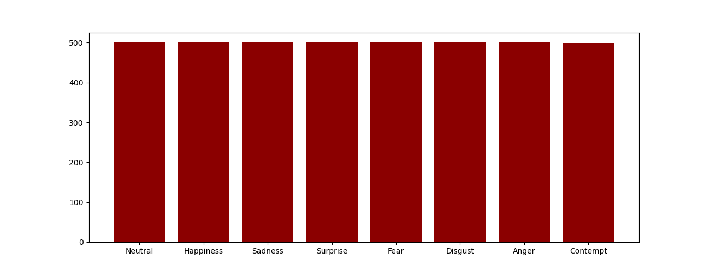

# Training baseline model

```bash
python train.py --device cuda
```

If you want to change training configuration, add configuration file(.yaml)  
Basic example of configuration is like below,
```yaml
emotion: True
gray: False
dataset:
  clsnum: 8
  batch: 32
  train_csv : '/data/FaceEmotion/AFFNet/train_set/train_dataset.csv'
  val_csv : '/data/FaceEmotion/AFFNet/val_set/val_dataset.csv'
train:
  model: 'resnet18'
  lr: 0.0001
  epochs: 20
  val_iters: 100
  loss: 'ce'
  optim: 'adamw'
  scheduler: {'MultiStepLR': {"milestones": [5, 10, 15, 20], "gamma": 0.5}}
  logit: False
  mix: False

```
And make sure if you want to add other augmentations, add them on configuration files
```bash
config
├── YOUR_CONFIG_NAME.yaml
``` 
and train model with,
```bash
python train.py --device cuda --config YOUR_CONFIG_NAME
```
# Ablation study(experiments) example
```bash
python train.py --device cuda --config YOUR_CONFIG_NAME --save checkpoint/YOUR_CONFIG_NAME --exp EXPERIMENT_NUMBER
```

# Dataset distribution
Use [Affect-Net dataset](https://paperswithcode.com/dataset/affectnet)  
You need to read README file in AFFNet directory. [Here](https://github.com/YAICON-HOTFACE/FER/tree/main/FaceEmotionTrain/AFFNet)
| Training dataset | Validation dataset |
|------------|-------------|
| <p align="center"></p> | <p align="center"></p> |
