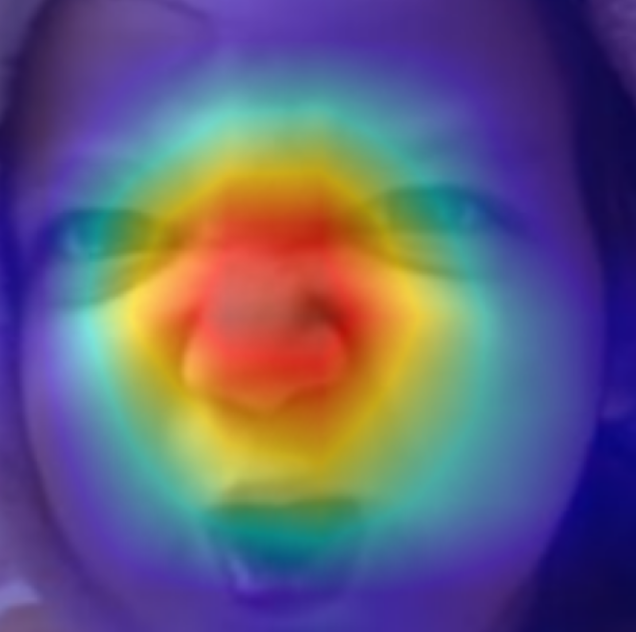

<!-- 
<p align="center"><a href="#">
    
</a></p>

 -->

<p align="center"; font-size=24px><b>YAI 10th facial image emotion recognition team</b></p>
</br>

---

# Face Emotion Recognition

Efficient expression / emotion classification of facial images through deep learning.

## Affect-Net dataset

Affect-Net is face expression dataset annotated with emotions, valence, and arousal.
It takes some approach to expressing a person’s emotion in a continuous space with regression.

<p align="center">  

<em> Mollahosseini, Ali, Behzad Hasani, and Mohammad H. Mahoor. "Affectnet: A database for facial expression, valence, and arousal computing in the wild." IEEE 2017 </em>
</p>

## Long tail distribution

In long tail distribution, there is some imbalance between head and tail distribution.
Affect-Net training set has long tail distribution.

<p align="center">  </p>

## Expreiments
We mainly did the experiments about data augmentation (mixup, cutmix, etc).
In addition, as wearing a mask has become a daily routine these days, we tested whether the model can capture emotions well with facial segments excluding mask part.

---

# Demo

Use `demo.py` to test our model.

## Install insight-face
```bash
pip install -U Cython cmake numpy
pip install onnxruntime-gpu
pip install -U insightface
```
## Requirements
```bash
pip install torch>=1.8.1 
pip install torchvision>=0.9.1
pip install pytorch-lightning
pip install numpy
pip install scipy
pip install opencv-python
conda install scikit-image
pip install tqdm
```
<p align="center">  </p>

---
# Tools for Training
## Data Augementations
### 1. Mixup
[mixup: Beyond Empirical Risk Minimization](https://arxiv.org/abs/1710.09412)

Examples of Mixup augmentation on Affect-Net dataset
<p align="center">  </p>

$$
\tilde{I} = \lambda \times I_a + (1-\lambda)\times I_b 
$$

$$
\rho_a = \lambda , \ \rho_b = 1-\lambda
$$

### 2. CutMix
[CutMix: Regularization Strategy to Train Strong Classifiers with Localizable Features](https://arxiv.org/abs/1905.04899)

Examples of CutMix augmentation on Affect-Net dataset
<p align="center">  </p>

$$
\tilde{I} = (1 - M_{\lambda}) \odot I_a + M_{\lambda}\odot I_b
$$

$$
\rho_a = 1-\lambda , \ \rho_b = \lambda
$$

### 3. SnapMix
[SnapMix: Semantically Proportional Mixing for Augmenting Fine-grained Data](https://arxiv.org/pdf/2012.04846.pdf)

Examples of SnapMix augmentation on Affect-Net dataset
<p align="center">  </p>

$$
\tilde{I} = (1 - M_{\lambda^a}) \odot I_a + T_{\theta}(M_{\lambda^b}\odot I_b)
$$

$$
S(I_i) = \frac{CAM(I_i)}{sum(CAM(I_i))}
$$

$$
\rho_a = 1-sum(M_{\lambda^a}\odot S(I_a)) 
$$

$$
\rho_b = sum(M_{\lambda^b}\odot S(I_b))
$$


### 4. Attentive CutMix
[Attentive CutMix: An Enhanced Data Augmentation
Approach for Deep Learning Based Image
Classification
](https://arxiv.org/pdf/2003.13048.pdf)

Examples of Attentive CutMix augmentation on Affect-Net dataset
<p align="center">  </p>

$$
\tilde{I} = {B} \odot I_a + (1-{B})\odot I_b 
$$


$$
\rho_a = \lambda , \ \rho_b = 1-\lambda 
$$

## Advanced AI explainability

[pytorch-grad-cam](https://github.com/jacobgil/pytorch-grad-cam)

### Visual Examples of CAM on Affect-net

| What makes the network think the image label is 'Fear' | What makes the network think the image label is 'Disgust' | What makes the network think the image label is 'Sad' |
| ---------------------------------------------------------------|--------------------|-----------------------------------------------------------------------------|
  |  |  |
---

# Contributors

<p align="left"; style="margin:0px 280px"> <b>
</br> 💻 &nbsp; 김주의, YAI 10th
</br> 💻 &nbsp; 박준영, YAI 9th
</br> 💻 &nbsp; 조용기, YAI 9th
</br> 💻 &nbsp; 조정빈, YAI 9th
</br> 💻 &nbsp; 황채연, YAI 10th
</b></p> 

⠀⠀⠀⠀⠀⠀⠀⠀⠀⠀⠀⠀⠀⠀⠀⠀⠀⠀⠀⠀⠀⠀⠀⠀⠀⠀⠀⠀⠀⠀⠀⠀⠀⠀⠀⠀⠀⠀⠀⠀⠀⠀⠀⠀⠀⠀⠀⠀⠀⠀⠀⠀⠀⠀⠀⠀
⠀⠀⠀⠀⠀⠀⠀⠀⠀⠀⠀⠀⠀⠀⠀⠀⠀⠀⠀⠀⠀⠀⠀⠀⠀⠀⠀⠀⠀⠀⠀⠀⠀⠀⠀⠀⠀⠀⠀⠀⠀⠀⠀⠀⠀⠀⠀⠀⠀⠀⠀⠀⠀⠀⠀⠀⠀⠀⠀⠀⠀⠀⠀⠀
⠀⠀⠀⠀⠀⠀⠀⠀⠀⠀⠀⠀⠀⠀⠀⠀⠀⠀⠀⠀⠀⠀⠀⠀⠀⠀⢠⡄⠀⠀⠀⠀⠀⠀⠀⠀⠀⠀⠀⠀⠀⠀⠀⠀⠀⠀⠀⠀⠀⠀⠀⠀⠀⠀⠀⠀⠀⠀⠀⠀⠀⠀⠀⠀
⠀⠀⠀⠀⠀⠀⠀⠀⠀⠀⠀⠀⠀⠀⠀⠀⠀⠀⠀⠀⠀⠀⠀⠀⠀⠀⣾⡇⣠⠀⠀⠀⠀⠀⠀⠀⠀⠀⠀⠀⠀⠀⠀⠀⠀⠀⠀⠀⠀⠀⠀⠀⠀⠀⠀⠀⠀⠀⠀⠀⠀⠀⠀⠀
⠀⠀⠀⠀⠀⠀⠀⠀⠀⠀⠀⠀⣀⡀⠀⠀⠀⠀⠀⠀⠀⠀⠀⠀⠀⢰⣿⣷⣿⠀⠀⠀⠀⠀⠀⠀⠀⠀⠀⠀⠀⠀⠀⠀⠀⠀⠀⠀⠀⠀⠀⠀⠀⠀⠀⠀⠀⠀⠀⠀⠀⠀⠀⠀
⠀⠀⠀⠀⠀⠀⠀⠀⠀⠀⠀⢺⣿⣿⣦⠀⠀⠀⠀⠀⠀⠀⠀⠀⢀⣿⣿⣿⣿⡇⠀⠀⠀⠀⠀⠀⠀⠀⠀⠀⠀⠀⠀⠀⠀⠀⠀⠀⠀⠀⠀⣠⣶⣦⡀⠀⠀⠀⠀⠀⠀⠀⠀⠀
⠀⠀⠀⠀⠀⠀⠀⠀⠀⠀⠀⠀⠙⢿⣿⣷⣦⡀⠀⠀⠀⠀⠀⢀⣾⣿⣿⣿⡟⠀⠀⠀⠀⠀⠀⠀⠀⠀⠀⠀⠀⠀⠀⠀⠀⠀⠀⠀⠀⠀⠀⠻⣿⡿⠃⠀⠀⠀⠀⠀⠀⠀⠀⠀
⠀⠀⠀⠀⠀⠀⠀⠀⠀⠀⠀⠀⠀⠀⠙⢿⣿⣷⣄⠀⠀⠀⠀⣸⣟⣿⣿⠏⠀⠀⠀⠀⠀⠀⠀⠀⠀⠀⠀⠀⠀⠀⠀⠀⠀⠀⠀⠀⠀⠀⠀⠀⠀⠀⠀⠀⠀⠀⠀⠀⠀⠀⠀⠀
⠀⠀⠀⠀⠀⠀⠀⠀⠀⠀⠀⠀⠀⠀⠀⠀⠙⢿⣿⣷⣄⠀⠀⢸⣿⡟⠁⠀⠀⠀⠀⠀⠀⠀⣀⣤⣤⣤⣤⣤⣤⣀⠀⣤⣤⡄⠀⠀⠀⠀⠀⢠⣤⣤⠀⠀⠀⠀⠀⠀⠀⠀⠀⠀
⠀⠀⠀⠀⠀⠀⠀⠀⠀⠀⠀⠀⠀⠀⠀⠀⠀⠀⠻⣿⣿⣧⡀⠸⡿⠀⠀⠀⠀⠀⠀⠀⣠⣿⣿⣿⡿⠿⠿⠿⣿⣿⣿⣿⣿⡇⠀⠀⠀⠀⠀⢸⣿⣿⠀⠀⠀⠀⠀⠀⠀⠀⠀⠀
⠀⠀⠀⠀⠀⠀⠀⠀⠀⠀⠀⠀⠀⠀⠀⠀⠀⠀⠀⢈⣿⣿⣿⠆⠁⠀⠀⠀⠀⠀⢀⣾⣿⣿⠟⠁⠀⠀⠀⠀⠀⠈⠙⣿⣿⡇⠀⠀⠀⠀⠀⢸⣿⣿⠀⠀⠀⠀⠀⠀⠀⠀⠀⠀
⠀⠀⠀⠀⠀⠀⠀⠀⠀⠀⠀⠀⠀⠀⠀⠀⠀⠀⣠⣾⣿⡿⠋⠀⠀⠀⠀⠀⠀⠀⣾⣿⣿⠃⠀⠀⠀⠀⠀⠀⠀⠀⠀⣿⣿⡇⠀⠀⠀⠀⠀⢸⣿⣿⠀⠀⠀⠀⠀⠀⠀⠀⠀⠀
⠀⠀⠀⠀⠀⠀⠀⠀⠀⠀⠀⠀⠀⠀⠀⠀⣠⣾⣿⡿⠋⠀⠀⠀⠀⠀⠀⠀⠀⠀⣿⣿⡏⠀⠀⠀⠀⠀⠀⠀⠀⠀⠀⣿⣿⡇⠀⠀⠀⠀⠀⢸⣿⣿⠀⠀⠀⠀⠀⠀⠀⠀⠀⠀
⠀⠀⠀⠀⠀⠀⠀⠀⠀⠀⠀⠀⠀⠀⣠⣾⣿⣿⠏⠀⠀⠀⠀⠀⠀⠀⠀⠀⠀⠀⣿⣿⣿⡀⠀⠀⠀⠀⠀⠀⠀⠀⠀⣿⣿⡇⠀⠀⠀⠀⠀⢸⣿⣿⠀⠀⠀⠀⠀⠀⠀⠀⠀⠀
⠀⠀⠀⠀⠀⠀⠀⠀⠀⠀⠀⠀⢀⣾⣿⣿⠟⠁⠀⠀⠀⠀⠀⠀⠀⠀⠀⠀⠀⠀⠘⣿⣿⣷⡄⠀⠀⠀⠀⠀⠀⠀⣰⣿⣿⡇⠀⠀⠀⠀⠀⢸⣿⣿⠀⠀⠀⠀⠀⠀⠀⠀⠀⠀
⠀⠀⠀⠀⠀⠀⠀⠀⠀⠀⠀⣴⣿⣿⠟⠁⠀⠀⠀⠀⠀⠀⠀⠀⠀⠀⠀⠀⠀⠀⠀⠙⢿⣿⣿⣶⣤⣤⣤⣤⣴⣾⣿⣿⣿⡇⠀⠀⠀⠀⠀⢸⣿⣿⠀⠀⠀⠀⠀⠀⠀⠀⠀⠀
⠀⠀⠀⠀⠀⠀⠀⠀⠀⠀⠀⠈⠛⠋⠀⠀⠀⠀⠀⠀⠀⠀⠀⠀⠀⠀⠀⠀⠀⠀⠀⠀⠀⠉⠛⠿⠿⠿⠿⠿⠟⠋⠁⠿⠿⠇⠀⠀⠀⠀⠀⠸⠿⠿⠀⠀⠀⠀⠀⠀⠀⠀⠀⠀
⠀⠀⠀⠀⠀⠀⠀⠀⠀⠀⠀⠀⠀⠀⠀⠀⠀⠀⠀⠀⠀⠀⠀⠀⠀⠀⠀⠀⠀⠀⠀⠀⠀⠀⠀⠀⠀⠀⠀⠀⠀⠀⠀⠀⠀⠀⠀⠀⠀⠀⠀⠀⠀⠀⠀⠀⠀⠀⠀⠀⠀⠀⠀⠀
⠀⠀⠀⠀⠀⠀⠀⠀⠀⢀⡀⣀⠀⠀⠀⠀⠀⠀⠀⢀⡀⠀⣀⠀⠀⠀⢀⣠⡤⡀⠀⢀⡀⠀⢠⡄⢀⡀⠀⠀⠀⠀⠀⣤⣤⣀⠀⠀⠀⠀⠀⠀⠀⠀⠀⠀⠀⠀⠀⠀⠀⠀⠀⠀
⠀⠀⠀⠀⠀⠀⠀⠀⠀⠀⢷⢧⣶⣴⣶⣦⡶⢦⣶⣸⠁⢠⣿⣴⡶⣿⢿⣿⡷⡇⡶⢾⢱⢶⣾⡇⢸⡇⣶⣦⣿⣴⣦⣿⣿⣿⣴⣶⣦⣶⣴⣶⣤⡶⣴⣦⠀⠀⠀⠀⠀⠀⠀⠀
⠀⠀⠀⠀⠀⠀⠀⠀⠀⠀⢸⠸⣿⢿⣿⡧⣽⠿⣽⢻⠀⢸⠛⣿⡇⣿⢸⣿⡇⡇⣧⣼⢸⣼⣿⡇⢸⡇⣿⣿⣿⢿⡿⣿⣿⣿⢿⣼⡿⣿⢿⣿⡿⣧⢿⡿⠀⠀⠀⠀⠀⠀⠀⠀
⠀⠀⠀⠀⠀⠀⠀⠀⠀⠀⠀⠀⠀⠀⠀⠀⠀⠀⠀⠀⠀⠀⠀⠀⠀⠀⠀⠀⠀⠀⠀⠀⠀⠀⠀⠀⠀⠀⠀⠀⠀⠀⠀⠀⠀⠀⠙⠛⠁⠀⠀⠀⠀⠀⠀⠀⠀⠀⠀⠀⠀⠀⠀⠀
⠀⠀⠀⠀⠀⠀⠀⠀⠀⠀⠀⠀⠀⠀⠀⠀⠀⠀⠀⠀⠀⠀⠀⠀⠀⠀⠀⠀⠀⠀⠀⠀⠀⠀⠀⠀⠀⠀⠀⠀⠀⠀⠀⠀⠀⠀⠀⠀⠀⠀⠀⠀⠀⠀⠀⠀⠀⠀⠀⠀⠀⠀⠀⠀

⠀⠀⠀⠀⠀⠀⠀⠀⠀⠀⠀⠀⠀⠀⠀⠀⠀⠀⠀⠀⠀⠀⠀⠀⠀⠀⠀⠀⠀⠀⠀⠀⠀⠀⠀⠀⠀⠀⠀⠀⠀⠀⠀⠀⠀⠀⠀⠀⠀⠀


